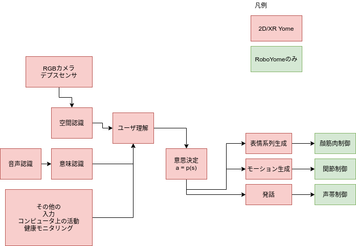

# project-orenoyome (My Waifu Project)
俺の嫁(My Waifu)を実現するための要素技術の論文、OSS、プロダクトの調査結果をまとめています。また、俺の嫁Projectを遂行するために共有すべきであろう基礎知識も共有しています。

ソースコードや得られた知見は出来る限りオープンにして、
世の中の嫁プロジェクト（やそれ以外のプロジェクト）にも貢献できればと思っています。

## 俺の嫁ロードマップ
嫁AIをざっくり３つに分類すると（実現に使うプラットフォームで）
2Dに移る嫁、XR空間上の嫁、ロボットの嫁です。
調査内容にはそれぞれのカテゴリで、どういったことを達成したいかということを記述していきます。

* 2D Yome
* XR Yome
* Robo Yome

## Yome Architecture
Yomeの実現に必要なコンポーネントは次の通りです。
$a=p(s)$の$s$は、エンジニアが実装したロジックにより抽出されたユーザや環境の状態です。
言葉のみの対話システムなら、意味ベクトルや文脈、RoboYomeなら、ユーザのジェスチャーを認識する必要もあるかもしれません。（例えば、膝をポンポンしながら、何か言われたら膝枕の合図かもしれません。）
YomeAIのレベルでEndToEndのモデルを使うのは難しくて、
意思決定の$a=p(s)$の$a$は制御信号とかではなく、大まかな行動（頭を撫でる。ねぎらいの言葉を言う）などになり、それぞれ子モジュールに委ねることになるでしょう。
例えば、Microsoftの[Xiaoice](https://arxiv.org/pdf/1812.08989.pdf)では、そのような階層によって返信を作っています。

（現時点の技術だと、これくらいの切り方になると思いますが、
今後、データが集まり、EndToEndモデルの研究が進めば、カメラやマイクの入力のみから、
ユーザに取って最適な行動をしてくれるAIが生まれるかもしれませんが、
10年くらいはかかるんじゃないでしょうか。ちなみに画像分類タスクにDeep Learningが使われてから、もう10年近くがたとうとしています。ときが立つのは早いです。）

## 要素技術の調査内容

* ソフトウェア開発支援: コンポーネントの開発の助けになる技術
* 外見生成: キャラクターの外見を生成する技術
* モーション生成: キャラクターの動きを生成するための技術
* 空間認識： 主にコンピュータビジョンを使った空間情報の認識
* [自然言語対話能力](language_understanding.md)：言語を使った対話能力
* デジタル空間認識: PC画面上のユーザの活動の認識
* 物理エンジン・3Dエンジン

## 基礎知識
基礎知識についてまとめていきます。

