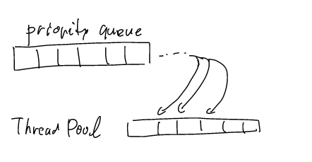
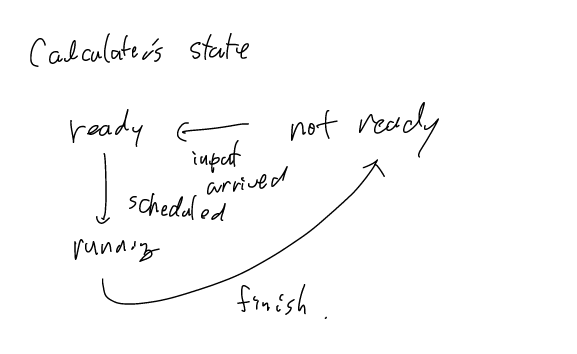

# 
## 並列化のモデル
認識パイプラインを作る場合、スレッドやforkによって、プログラムを並列化すると思いますが、
その場合、自分で並列処理を設計してコーディングする必要があります。
Mediapipeでは、次のような汎用的に使える並列化の仕組みを提供しており、
Calculatorのみ書けば自動的に並列化してくれます。

並列化のモデルはN個のスレッドと優先度つきキューで実行準備が整ったCalculatorのうち、
優先順位が高いものから順に実行されます。

!!! todo
    * スケジューラについて調べる
      * 次のインプットが来て次のグラフが実行されたらどうなる？
        * 元のものは捨てる？
    * アプリに適しているかわかるように
    * この仕組みだと何が保証される？

## エラー処理
mediapipeのエラー処理はC++の例外システムではなく、独自のフレームワークを使っています。
Statusクラスに成功の有無やエラーの詳細をいれて、それを戻り値で伝搬させるような仕組みです。
これは、[Googleの既存プロダクトで例外があまり使われていないという特殊な事情](https://google.github.io/styleguide/cppguide.html#Exceptions)が関係していて、Googleが公開しているOSSもスタイルガイドの影響を受けているからこうなっています。

基本的にmediapipeの失敗する可能性のあるメソッドの多くは`Status`クラスを返却するようになっていて、
値を返却するメソッドに関しては、`StatusOr<T>`を返却するようになっています。

また、Statusを便利に扱うためのマクロも定義されていますが、クラスでラップする場合など、コンストラクタやデストラクタでは使えないので、
自前のマクロを定義したほうが良さそうです。

このエラーの伝搬の仕方をアプリケーション側でも真似する必要はなくて、あくまで色々なアプリで使うライブラリを作る場合は、
例外を使うよりもこのような自前エラー処理が良いということです。ただ、Statusのチェックをして、失敗時にエラーメッセージを出力しないと、デバッグがやりにくのでその点だけ注意してください。

## データ構造
### 画像
