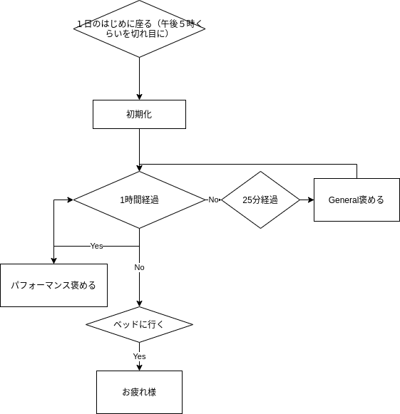

# エージェントに褒められる効果
## 雑フローチャート
https://twitter.com/_xiongjie_/status/1348521913253982210

## パフォーマンス指標
* リポジトリのコード量(タイピング量?)
* 文章書いた量
* 勉強した量

## コード量、文章書いた量の把握
* コミット数
* 前回のコミットとの差分を計測
* ファイルの種類により、文章、コード、画像に分類して褒める。
* 文字数、行数が増えたら褒める。
* いいねを得たツイート数も褒められる
* githubのスター数
