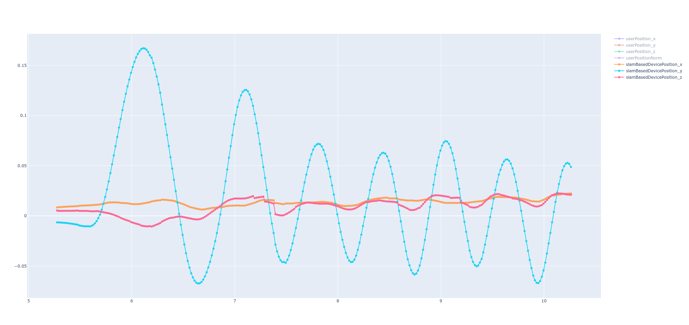

# IMUとSLAMを使った腰の動きの解析と腰の動きに合わせた音声再生アプリの実装
近年、空○嫁やお○ホールなど、様々なデバイス？が普及しつつあります。
そこで、これらのデバイスを拡張できるよう、ジャイロセンサを使って、腰の動きに連動して音声を再生するアプリの実装をしました。ジャイロセンサはほぼ全てのスマホに載っているため、大体のスマホで使えるはずです。まだ、調整の余地はありますが、音声の再生タイミングはそこそこ使えるものになりました。（何に）このアプリに関連する技術について説明していきます。

## 解析対象の運動
解析対象の運動に関してですが、

* 前後運動である。
* 前後運動の振幅・周波数に変化がある。

1に関して、前後運動をしているか否か。前向きの動きか後ろ向きの動きかを区別したい。前向きの運動に関しては運動が始まり次第、できるだけ早いタイミングでオンラインで区別したい。
2に関しては、この振幅と周波数の変化により、デバイスをつけているユーザの状態をある程度推定できるはずなので、ユーザ状態推定にも挑戦したい。（こちらは本記事では実現できませんでした。）

## 腰の移動量の推定に使える情報
### IMUのRawデータ
端末の加速度と角速度が得られるため、これらのRaw値や、
これらの値から推定された位置や端末姿勢を使うことが考えられます。

UnityのAPIを使えば得られます。

### SLAMを使ったスマホのポーズ推定結果
SLAMで、端末の位置と姿勢を計算できます。
位置と姿勢は、カメラから得られた特徴量の移動量と、
IMUから計算することが多く、おそらく、ARで使われているSLAMはそのようになっているはずです。
IMU以外にRGBカメラとか追加のセンサがあることでできます。

例えば、ARFoundationで提供されているAPIを使って、端末の位置をUnity内で使えるようにできます。端末の初期位置からの相対位置が得られます。

ただ、ARFoundationのデフォルト設定でカメラ位置の推定をした場合、
次のような結果になり、前後運動の取得に役立ちそうではありませんでした。
iPhoneXSで検証しましたが、
カメラのフレームレートが移動の速さに対して低くモーションブラーなどによって、
特徴の移動量計算に誤差が出たのが原因だと予想しています。

!!! todo
    * モーションブラーが起こっていることの検証。
    * フレームレート設定の検討。OculusQuestとの比較

## 位置と速度と加速度の関係
位置と速度と加速度の関係は次の通りです。

連続的なx,y,aが得られていると仮定したとき、
$$
v(t) = \frac{dx(t)}{dt}
$$
$$
a(t) = \frac{dv(t)}{dt}
$$

です。理論的な関係はこの式でわかります。例えば、sin(t)のような、周期的な動きの場合、
$$
v(t) = cos(t)
$$
$$
a(t) = -sin(t)
$$
と、位相が$\frac{\pi}{2}$ずつずれていきます。なので、１周期の$\frac{1}{4}$のズレがあります。

IMUのみ使う場合は、$a(t)$とカルマンフィルタなどに推定された姿勢$p(t)$が得られます。
ただし、tは連続ではなく、離散的な点に対して得られます。
また、ノイズもあります。

SLAMを使うと、$x(t)$が得られます。
位置が重要なアプリケーションでは必要になってくると思います。
例えば、ゆっくりとした動作でカメラが隠れていない場合、スマホを上下に動かすとこのようなきれいなグラフが得られます。

今回は、動きを検出して、いいタイミングで音を鳴らすのみなので、
Accelerometerの$a(t)$を使います。

## 動きの推定
とりあえず、どの位置だろうと、前後運動が起こったらそれを検知するアルゴリズムを作ります。
周波数の変化を早く検知して、そのタイミングで推定状態をゆっくり、早い、終わりそう。の３つのどれかに設定します。（今回とったデータを見る限り方法が思いつきませんでした。）
また、その周期内である位置を通過したタイミングの検知もします。
そのタイミングで音を鳴らすことで、今回目的のアプリを実装します。

### 周波数計算
2,3秒くらいのウィンドウに対して、
フーリエ変換を適用して、その周波数成分を特徴量として、
ルールベースでゆっくり、激しい、終わりそうに分類することで、動きを解析してみます。

実際に腰の後ろにスマホを固定して、
前後運動をやってみて、それをフーリエ変換してみたところ、
前後運動の有無程度なら検出できそうでしたが、はっきりと周波数の違いとしては出ませんでした。
周波数解析の図は次の通りです。

!!! todo
    もう少しデータを整理して解析してみたいところです。

### ある位置の通過を検出
1. 加速度の時系列データにローパスフィルタを加える
2. ノイズが減った波形の振幅がある点を"通過"したときに、タイミング検出をする。

という流れになります。加速度とジャイロセンサで計算されたユーザの加速度の波形は
このようにノイズがのっていますが、調整したローパスフィルタを適用することで、
このようにある程度きれいになります。

このように立ち上がりの段階もうまく残してくれるので、
タイミング検知に使えます。

今回は、適当にスレッショルドを設定して、その点を通過したときに、
音を鳴らすという実装にしました。
